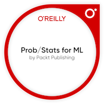

## Hi there, I'm Sarah F. Fernn | (she || her) 

  
<!-- My Stats -->

## My Stats 

  ( Follow me here  and welcome! You are the  person here)
     
  
     
    
   
    

  

## Tech Stack

              

<!-- My Bio --> 
  
## More About Me 

🔹 ...My nick is Shuri (yeah, like in #BlackPanther) 

💼 I'm the founder & CEO @ Stardust Zone, working for neurodivergent inclusion and prosperity amongst societies

📚 Also I'm studying Software Engineering @ École 42, in addition to my Public and Private management background...
📚 ...Oh, and I learned other stuff in tech through **[Kaggle]**, **[Instituto Sezerdêllo Corrêa - Brasília/Brazil]]** and through a past scholarship @ **[Programaria]** 

  
> My focuses

🔍 Currently I'm exploring **[DevOps]**, **[A.I. for Good]**, **[Software Architecture]** and applying this knowledge in socialtech and civictech initiatives

😄 ... Thus I'm engaged in: **[CivicTech]**, **[SocialTech]** and **[DeepTech areas]** because I believe technology should empower people, foster inclusion, and be a force for systemic change especially for those historically left on the margins

  

> My Learnings

🛠️ By the way, I'm continuously Learning: **[C]** | **[Python]** | **[Akoma Ntoso]** | **[LexML]** | **[LEOS]**, that nowadays help me to build inclusive digital legal frameworks, develop civic-minded tools, and contribute to open, interoperable systems that serve real social impact

🤖 Also learning fields/techniques as #NeuralNetworks | #NLP | #ML, because understanding how machines process language and patterns enables me to design intelligent systems that amplify human potential and create more adaptive technologies for diverse minds, driving #AIforgood 

  

> My mission is to... 

...Engineer a future where #tech not only include the unheard, but also amplifies their voices, talents and impact

---
  
## Highlighted Badges & Certifications

---

## Contributions 

  

## Contact me at 

