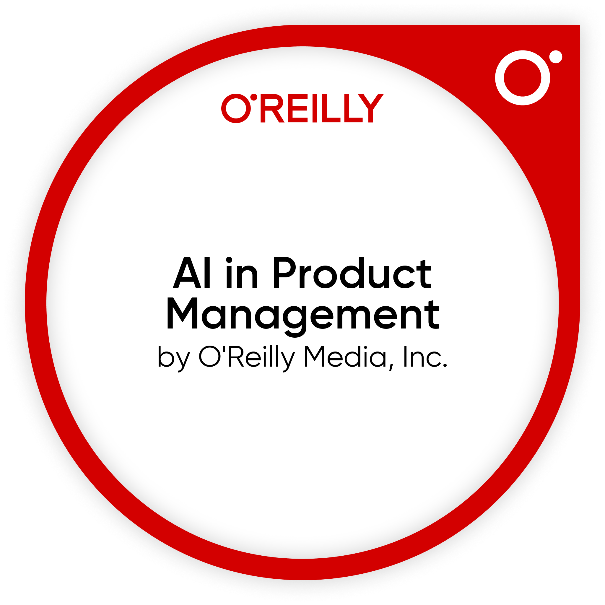

## Hi there 👋

- 🔭 Currently working on: Software Architecture and CivicTech/SocialTech
- 🌱 Learning: C, Python and Akoma Ntoso, ML 
- 👯 Looking to collaborate on: AI for Social Good projects/Hackathons
- 🤔 Looking for help with: Data Structures and DevOps 
- 💬 Ask me about: Entrepreunership and Tech for Public Good
- 📫 How to reach me: https://www.linkedin.com/in/sarahfernn
- 😄 Pronouns: she || her
- ⚡ Fun fact: My ally is the force...

My recent badges:

