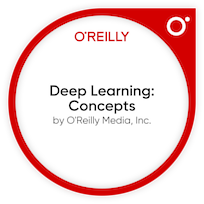
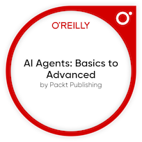
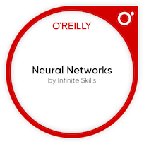

## Hi there, I'm Sarah F. Fernn, and... | (she || her) | (  /  )

  
> More About Me 

🔹 ...My nick is Shuri (yeah, like in #BlackPanther) 

💼 I'm the founder & CEO @ Stardust Zone, working for neurodivergent inclusion and prosperity amongst societies...

📚 ...Also I'm studying Software Engineering @ École 42, in addition to my Public and Private management background

  

> My focuses

🔍 Currently I'm exploring #DevOps | A.I. for Good | #SoftwareArchitecture and applying this knowledge in socialtech and civictech initiatives

😄 ... Thus I'm engaged in: #CivicTech | #SocialTech | #DeepTech areas, because I believe technology should empower people, foster inclusion, and be a force for systemic change especially for those historically left on the margins

  

> My Learnings

🛠️ By the way, I'm continuously Learning: #C | #Python | #AkomaNtoso | #LexML | #LEOS, that nowadays help me to build inclusive digital legal frameworks, develop civic-minded tools, and contribute to open, interoperable systems that serve real social impact

🤖 Also learning fields/techniques as #NeuralNetworks | #NLP | #ML, because understanding how machines process language and patterns enables me to design intelligent systems that amplify human potential and create more adaptive technologies for diverse minds, driving #AIforgood 

  
> My mission is to... 

...Engineer a future where #tech not only include the unheard, but also amplifies their voices, talents and impact

---
  
## Highlighted Badges & Certifications

---
  
## Languages

---
  
## Contact me 

