

# Sarah F. Fernn · `Shuri` · she/her

**Electrical & Computer Engineering · International Relations · Public Management** 
*Founder · Curious · Navigator of minds & systems*

`SpaceTech` · `CivicTech` · `DeepTech` · `NeuroTech`

> My mission is to engineer a future where tech not only includes the unheard, 
> but also amplifies their voices, talents and impact.

[About](#-about-me) · [Tech Stack](#-tech-stack) · [Networks](#-networks--mentoring) · [Recognitions](#-prizes--recognitions) · [Certifications](#-badges--certifications) · [Stats](#-github-stats)

---

## ✦ About Me

Besides being a social entrepreneur on inclusion, accessibility and education in cognitive diversity applied to the STEAM field, I study and work to bridge the gap between **electrical engineering, computer science and international relations**, designing integrated systems that account for complex global political and economic landscapes.

My approach combines technical expertise in **robotics and sensor technology** with a strategic understanding of geopolitical trends and diplomatic negotiation on science and tech, with a special focus on **techno-geopolitics and innovation diplomacy**.

I am driven to analyze and navigate the interplay between emerging technologies and the multifaceted systems of global affairs, and areas contemplated by anticipatory science, such as **astropolitics, neurotechnology and computational neuroscience**.

| | |
|---|---|
| 🏢 **Founder & CEO** @ `Stardust Zone` | The Social DeepTech for neurodivergent inclusion in STEAM & the labour market |
| 🔭 **Co-founder** @ `Zenith Space` | The Think Tank in SpaceTech, New Space, Space Law & Astropolitics |
| 🧠 **Proudly `AuDHD`** | Social entrepreneur, jr software engineer, from maker culture |
| 🌍 **Based in** | São Paulo and Florianópolis, Brazil |
| 🎓 **Studying now** | Electrical and Computer Eng. & IR (in progress) |
| 📜 **Former studies** | Software Eng. @ École 42 · Public & Private Management (UFF/UFRRJ) |
| 🏅 **Scholarships** | PGLF Russia & Bulgaria · O'Reilly DEI Scholarship · Programaria · University of La Verne · AUBG · RANEPA |
| 🌐 **International orbit** | Professional/academic exchanges in USA · Germany · Bulgaria · Russia · Japan · South Africa |

---

## ✦ Tech Stack

| Area | Tools |
|---|---|
| **Languages** |           |
| **AI, ML & Data** |            |
| **Dev & Frameworks** |        |
| **DevOps** |    |
| **Hardware** |   |
| **Docs & PM** |    |
| **Design & Product** |          Adobe: Photoshop · Illustrator · InDesign · Lightroom (+ Classic) · After Effects · Premiere Pro · XD · Acrobat |

<!-- To add: Tableau, Google Data Studio, Claude Code, OpenAI Codex, Lovable, MS Copilot, Google Antigravity, Google Gemini -->
<!-- To add: Akoma Ntoso, LEOS, VIM, VS Code, Serious Lego, ClickUp, Obsidian, NotebookLM -->
<!-- To add: Google Nano Banana, Google Flow, Google Lyria 3, Google Pomelli, Google Stitch -->

---

## ✦ Networks & Mentoring

<table>
<tr><th>Networks</th><th>Mentoring & Programs</th></tr>
<tr valign="top"><td>

| Network | Role |
|---|---|
| Google Student Ambassador Brazil | Member |
| Stanford Lemann Center Talent Network | Member |
| iFood AGI Club | Member |
| YLAI – Young Leaders of the Americas (U.S. Dept. of State) | Member |
| Forbes BLK | Member |
| G20 South Africa 2025 | Former Member |
| G20 Brasil 2024 | Former IR Leader / TF Investment |
| UN/SEBRAE Empretec | Alumni |

</td><td>

| Program | Role | Year |
|---|---|---|
| Move +Mulheres (+Unidos/Alcoa) | Mentor | 2026 |
| Orgulho Empreendedor | Mentor | 2026 |
| HaCARthon (Dataprev/Enap) | Mentor | 2026 |
| AWE Brazil (+Unidos/U.S. Embassy & Consulates in Brazil) | Former Mentor | 2025 |
| Harvard HBASS 2024 | Former Mentee | 2024 |
| AWE Ecuador (Quito Chamber of Commerce/U.S. Dept. of State) | Former Mentor | 2024 |

</td></tr>
</table>

---

## ✦ Prizes & Recognitions

**Highlights (Stardust Zone):** 🏆 Bradesco InovaBra PRIA – AI Residence (2026) · 🏆 SEBRAE Top 1000 Startups (2026) · 🏆 Google Cloud for Startups (2026) · 🥇 Empreendedoras Tech (2024) · 🥇 Japan J-Wings (2024)

<b>See all 14 recognitions</b>

| Year | Recognition | Role |
|---|---|---|
| 2026 | Bradesco InovaBra PRIA – AI Residence | Leader of the Selected Startup (Stardust Zone) |
| 2026 | SEBRAE Top 1000 Startups | Leader of the Selected Startup (Stardust Zone) |
| 2026 | Google Cloud for Startups | Leader of the Selected Startup (Stardust Zone) |
| 2026 | UpStars (CMEC/ACSP) | Leader of the 4th Place Startup (Stardust Zone) |
| 2025 | BRDE Labs SC | Leader of Finalist Startup (Stardust Zone) |
| 2025 | Startup Weekend Socioambiental @ 42 São Paulo | Winner Entrepreneur |
| 2024 | Empreendedoras Tech (MDIC / SEBRAE / ENAP / Impact Hub) | Leader of the Winner Startup (Stardust Zone) |
| 2024 | Japan J-Wings (JICA + BVC) | Leader of the Winner Startup (Stardust Zone) |
| 2024 | 1st Public AI Competition (MDIC + Intel) | Leader of a Finalist Startup (Stardust Zone) |
| 2024 | Jornada Startups | Leader of a Sealed Startup (Stardust Zone) |
| 2023 | BNDES Garagem | Leader of a Sealed Startup (Stardust Zone) |
| 2023 | Nossa Parte Pela Educação (IBRF + Quintessa) | Leader of a Sealed Startup (Stardust Zone) |
| 2017 | StartupRIO (Faperj) | Leader of a Sealed Startup (Universidados) |
| 2016 | StartupRIO (Faperj) | Leader of a Sealed Startup (Meu Campus) |

---

## ✦ Badges & Certifications

Click a category to expand · each badge links to its Credly verification

<b>Programming Languages</b> (2)

 

<a href="https://www.credly.com/badges/ef63901c-3a41-47f6-990c-17205ec873dc/public_url">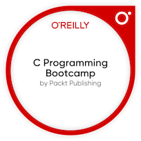</a>

<b>AI & Machine Learning</b> (7)

 

<a href="https://www.credly.com/badges/e6ab8378-6f13-4b91-8f0f-557dfdc7e45e/public_url">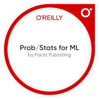</a>
<a href="https://www.credly.com/badges/942abfca-c477-48d6-8138-e667cc98b04a/public_url">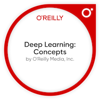</a>
<a href="https://www.credly.com/badges/2eccda5e-a68c-4e03-a22e-d85c674c6bbe/public_url">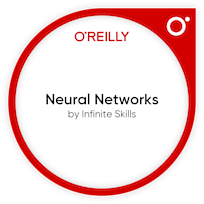</a>
<a href="https://www.credly.com/badges/08831ac0-e00e-42dc-bcab-6eb2a9d8aa52/public_url">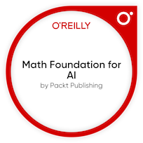</a>

<b>Software Architecture & Engineering</b> (6)

 

<a href="https://www.credly.com/badges/a2cefa0c-2a4b-4553-9041-970fb4cf9d54/public_url">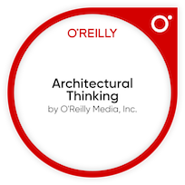</a>

<a href="https://www.credly.com/badges/46b81498-fe5e-4dfc-bbb3-91d31bdfa512/public_url">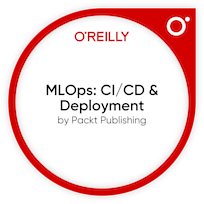</a>

<a href="https://www.credly.com/badges/56f2669d-a377-405d-b586-8139061b2a08/public_url">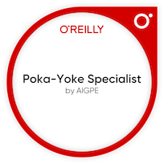</a>

<b>Electronics & IoT</b> (5)

 

<a href="https://www.credly.com/badges/539717c8-50ee-40cb-bd66-1533ec2943ea/public_url">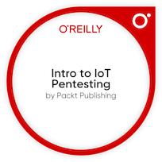</a>
<a href="https://www.credly.com/badges/a0d4aa19-b6b8-4904-9c6e-eb0ff3b59608/public_url">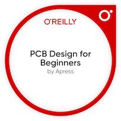</a>
<a href="https://www.credly.com/badges/42d8e79c-167c-4552-814c-725bc97e9b2e/public_url">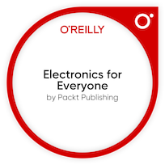</a>

<b>Cybersecurity, Pentesting & Ethical Hacking</b> (14)

 

<a href="https://www.credly.com/badges/cc0c7eff-f882-4819-ab8a-606f6c22a443/public_url">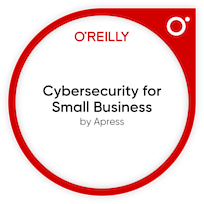</a>
<a href="https://www.credly.com/badges/523341da-0244-4dcd-a59a-c09e5c863734/public_url">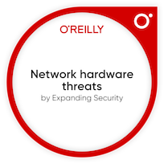</a>

<a href="https://www.credly.com/badges/41f5cf2e-b6c6-42c5-9e4f-ad684fbcc3ae/public_url">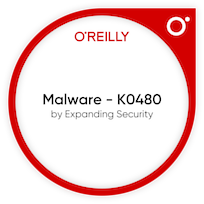</a>

<a href="https://www.credly.com/badges/997ae50e-7551-4d95-b7fc-3fbed6e41ac1/public_url">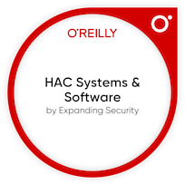</a>

<b>Governance & Legislation</b> (4)

 

<b>Quantum & Related</b> (3)

 

<a href="https://www.credly.com/badges/dd7a982d-916c-457b-a0d2-7a2e12a1f8d0/public_url">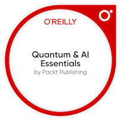</a>
<a href="https://www.credly.com/badges/44fb3616-4ca1-4951-bd78-bc193c9d1078/public_url">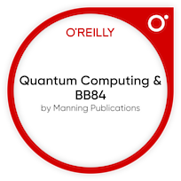</a>

---

## ✦ GitHub Stats

